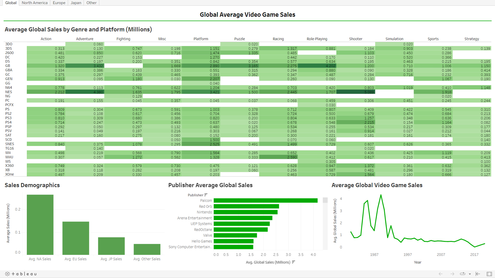

# HoK_Tableau

These are my Tableau projects and practice. To open the file, click on the link on the title of the project. I use Tableau Public to practice because I do not have a Tableau membership. The data used is in the data folder in this repository.

## [Personal Project, Data Visualization: Video Game Sales Dashboard:](https://public.tableau.com/app/profile/kevin.ho2831/viz/AverageVideoGameSales/Global?publish=yes)

This is a project I worked on to practice and showcase Data Visualization skills with the Tableau software. I downloaded the data from kaggle.com and imported it into Tableau Public.

I began by thinking about factors of the collected data could affect sales, and used that to dictate my dashboard. I started simple by creating a bar chart to display the global sales demographics over the recorded locations in the data. We can see evidence that North America, on average, sells more video games than the rest of the world. I used a bar chart to have a side-by-side visual to display the differences between regions. Next, I was wondering when the average video game sales were the highest, so I created a line graph showing the average global sales each year, and found that 1989 was the all time high for average video game sales globally. I used a line graph to display the change of average global sales each year. After analyzing the data farther, I wondered which video game publisher had the most sales, so I created a bar chart to display that and I was surprised that it was a publisher I did not know about. The publisher with the most sales turned out to be Palcom with 4.17 million sales. With the remaining data, I wondered how many sales each video game system had and I realized I could break it down even farther by seperating the sales by genre. I turned the data into a heat map to visually display which genres for each console were outstanding. The result of my dashboard is shown below:

After some deeper Tableau research, I figured out that I can make the dashboard interactive so if I click on a genre or console on the heat map, year on the line chart, or publisher on the bar chart, it would change the charts to display all the data filtered on that data. See examples below:

The dashboard below is the dashboard when the datapoint when 1989 is selected on the line graph for global video game sales:

The dashboard below is the dashboard when the datapoint when PS4 is selected on the heat map for global video game sales:

The dashboard below is the dashboard when the datapoint when Sony is selected on the bar chart for global video game sales:

Once the dashboard was finished, I realized that you can show tabs on the dashboards once it is published, so I went back to break the data down even farther. The data contained sales for different areas of the world, so I created a dashboard for each of these locations to answer all of the previous questions, but for each of these locations. See below:

The dashboard below is the dashboard displaying average video game sales for North America:

The dashboard below is the dashboard displaying average video game sales for Europe:

The dashboard below is the dashboard displaying average video game sales for Japan:

The dashboard below is the dashboard displaying average video game sales for the rest of the world excluding the previous locations:

